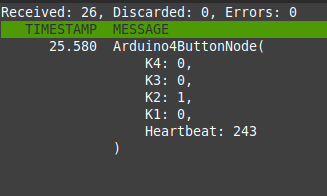

# **03**: CAN_4Buttons

A sketch to put the status of 4 buttons connected to Digital pins 3-6 onto the CAN bus.

Compile:

    pio run

Upload to Arduino:

    pio run -t upload

Monitor the serial output:

    pio run -t monitor

Monitor ```can0``` and decode it with the provided ```.json``` (needs converted to dbc first). 


     canconvert can_db.json can_db.dbc
     cantools monitor --channel can0 can_db.dbc

